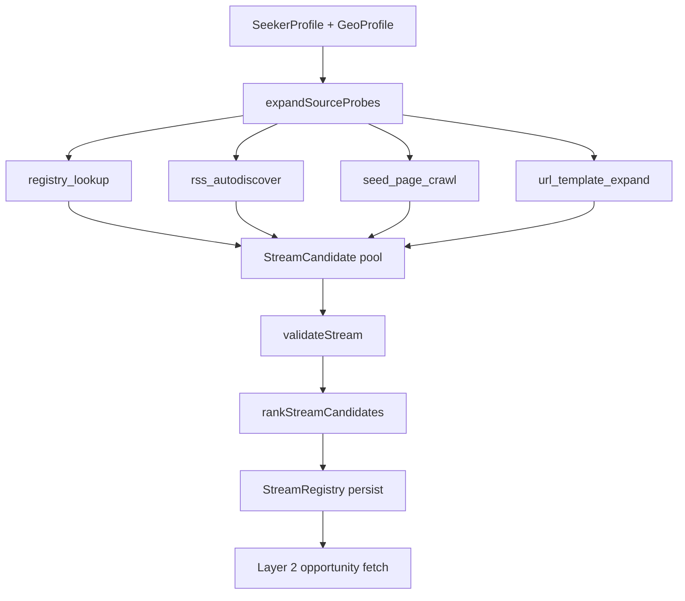

# Source discovery — design proposal

**Status:** Draft (Phase 2 architecture)  
**Depends on:** Phase 0–1 engine (parse, match, onboarding)  
**Complements:** [discovery-and-matching.md](./discovery-and-matching.md), Aperio [engine/pipeline.md](../../aperio/docs/engine/pipeline.md)

---

## Problem

Today aperio-j assumes **human-curated stream lists** (RSS URLs, city packs). That does not scale:

- Shenzhen ≠ Guangzhou ≠ random city — manual packs break geographic flexibility
- Employment feeds move, die, or block bots — static lists rot
- OSS / i18n future requires **locale-aware intake**, not hard-coded CN feeds

**Goal:** The engine discovers **poll targets (streams)** from user configuration, then runs the existing opportunity pipeline on whatever it found.

> User configures *who they are and where they are* — not *which RSS URLs to poll*.

---

## Mental model (three layers)

Aperio separates **profile expansion → fetch → match**. We add an upstream stage:

```
┌─────────────────────────────────────────────────────────────────┐
│  Layer 1 — SOURCE DISCOVERY (new)                               │
│  SeekerProfile + GeoProfile → probes → candidate streams        │
│  validate → rank → StreamRegistry (per user)                    │
└────────────────────────────┬────────────────────────────────────┘
                             ▼
┌─────────────────────────────────────────────────────────────────┐
│  Layer 2 — OPPORTUNITY DISCOVERY (shipped)                      │
│  enabled streams → fetch → parseOpportunity → dedupe → index    │
└────────────────────────────┬────────────────────────────────────┘
                             ▼
┌─────────────────────────────────────────────────────────────────┐
│  Layer 3 — PROFILE MATCHING (shipped)                         │
│  constraints + intent + capability → score → rank → explain     │
└─────────────────────────────────────────────────────────────────┘
```

Analogous to Aperio:

| Aperio | aperio-j |
|--------|----------|
| Portfolio + discovery profile | SeekerProfile + GeoProfile |
| Query expansion (`expandDiscoveryProfileFromPortfolio`) | **Probe expansion** (`expandSourceProbes`) |
| Information streams (user adds RSS) | **Auto-discovered streams** + optional user override |
| Connectors (HN, GitHub, …) | **Regional connectors** (public job boards, gov feeds) — optional |
| Stream ROI / learning weights | **Source health** — prune dead feeds, boost productive ones |

---

## Core types (proposed)

```typescript
/** What we search *with* to find sources — not job listings yet. */
interface SourceProbe {
  id: string;
  kind: "rss_autodiscover" | "url_template" | "seed_page_crawl" | "registry_lookup";
  label: string;           // auditable human label
  seed: string;            // URL or template key
  regionHint: string;      // e.g. 深圳, CN-GD
  intentTerms: string[];   // from desiredRoles expansion
  rationale: string;       // why this probe exists
}

/** A poll target the engine believes is worth trying. */
interface StreamCandidate {
  id: string;
  label: string;
  kind: "rss" | "list_page" | "url_pattern";
  seedUrl: string;
  discoveredVia: string;   // probe id
  regionHint: string;
  confidence: number;      // 0–1 validation score
  sampleItemCount: number;
  lastValidatedAt: string;
  health: "unknown" | "healthy" | "stale" | "dead";
}

/** Persisted per user — replaces static DEFAULT_STREAMS. */
interface StreamRegistryEntry extends StreamCandidate {
  userId: string;
  enabled: boolean;
  pollLane: "hot" | "warm" | "cold";
  opportunityYield: number;  // items / last N polls
  matchYield: number;        // matched items / last N polls
  learningWeight: number;    // like Aperio streamDiscoveryWeight
}
```

---

## Layer 1 — Source discovery pipeline



### Step 1 — Probe expansion (`expandSourceProbes`)

Inputs from onboarding — **no manual URL entry**:

| Input | Expands to |
|-------|------------|
| `primaryCity` + `acceptableCities` | region codes, district names, local language variants |
| `desiredRoles` | synonym probes (质检 → QC, 品检, …) — reuse intent expansion |
| `desiredIndustries` | industry tokens for URL/title relevance |
| `languages` | locale for template pack selection (`zh-CN`, `en-US`, …) |
| `remotePreference` | include/exclude remote-board probes |

Output: ordered list of `SourceProbe` (cap ~20 per run for budget).

**Design rule:** expansion is **deterministic and logged** — same profile → same probes (modulo registry version).

### Step 2 — Discovery strategies (v1, no LLM)

| Strategy | Mechanism | Bound |
|----------|-----------|-------|
| **registry_lookup** | Locale-keyed JSON: known public employment portals, gov HRSS patterns, university job boards | O(1) lookup |
| **url_template_expand** | Templates: `{city}人社 招聘`, `{city} 公共就业`, `{region} labor rss` → candidate URLs via fixed table | No search engine |
| **rss_autodiscover** | GET seed page → parse `<link rel="alternate" type="application/rss+xml">`, `/feed`, `/rss.xml` heuristics | 1 hop |
| **seed_page_crawl** | Same-regime link follow from official `.gov.*` / `.edu.*` pages only; max depth 2, max 30 URLs | robots.txt respect |

**Explicit non-goal v1:** open-ended Google/Bing scraping, Indeed/LinkedIn HTML scrape at scale.

### Step 3 — Validation (`validateStream`)

Before enabling a candidate:

1. **Fetch test** — HEAD/GET seedUrl, timeout 15s
2. **Parse test** — RSS: ≥1 item; list_page: ≥1 listing-shaped block (title + link heuristic)
3. **Geo sniff** — sample text contains city/region OR explicit remote
4. **Intent sniff** — sample overlap with expanded role terms (weak signal OK)
5. **Trust sniff** — landing domain not on blocklist (known scam aggregators)

`confidence = weighted sum` → candidates below 0.4 discarded.

### Step 4 — Ranking & registry

Rank survivors by:

- validation confidence
- domain trust tier (gov > edu > company > aggregator > unknown)
- historical `matchYield` if re-run

Persist top N (default 8–12 enabled streams per user). User can disable in Settings later (Phase 2 UI).

---

## Layer 2 & 3 — unchanged contract

Once `StreamRegistry` is populated, **existing** code runs:

```
enabled streams → fetchRssFeed / list fetcher → parseOpportunity → index
SeekerProfile → scoreOpportunity → rank → explain
```

Layer 1 runs:

- on **onboarding complete**
- on **profile geo/intent change**
- on **weekly cron** (refresh dead sources, discover replacements)

---

## Geographic flexibility (i18n-ready)

Geo is not a hard-coded city list in code — it is a **ProbePack**:

```
ProbePack
  locale: "zh-CN"
  region: "GD-SZ"          // Guangdong Shenzhen
  cityLabels: ["深圳", "深圳市"]
  districts: ["龙岗", "宝安", …]
  seedDomains: ["sz.gov.cn", "hrss.sz.gov.cn", …]
  urlTemplates: [...]
  roleLexicon: { 质检: [...], 仓储: [...] }
```

| User sets | Engine loads |
|-----------|--------------|
| 深圳 | `ProbePack` best match for CN + 深圳 |
| New York | `en-US-NYC` pack (future OSS community pack) |
| Unknown city | generic pack: `{city}` template only + autodiscover from user-supplied seed URL (optional) |

**OSS path:** ship core engine + empty registry; community contributes `probe-packs/` per locale (like Aperio `stream-bundles` but geo-keyed).

---

## Learning loop (Aperio parity)

Reuse Aperio Stream Explorer ROI concepts:

| Signal | Effect on Layer 1 |
|--------|-------------------|
| Stream returns 0 items × 3 polls | mark `dead`, trigger re-discovery |
| Stream items never match | lower `learningWeight`, eventually disable |
| Stream items frequently matched/applied | raise weight, poll more often (`hot` lane) |
| User marks `agency-scam` from source | blacklist domain for user |

Store per-run manifest (like Aperio `DiscoveryRunManifest`):

```typescript
interface SourceDiscoveryRun {
  id: string;
  seekerProfileId: string;
  probes: SourceProbe[];
  candidatesFound: number;
  candidatesEnabled: number;
  errors: string[];
  ranAt: string;
}
```

---

## Package layout (proposed)

```
packages/
  core/           + SourceProbe, StreamCandidate, StreamRegistryEntry
  probe/          NEW — expandSourceProbes, ProbePack registry, url templates
  discovery/      + validateStream, discoverStreams, rss autodiscover, bounded crawl
  matcher/        unchanged
  db/             + StreamRegistry, SourceDiscoveryRun tables
```

`apps/web` — onboarding triggers source discovery before first match; Settings → Streams (read-only discovered + disable toggle).

---

## Phased delivery

| Phase | Scope | Exit criteria |
|-------|-------|---------------|
| **2a** | `expandSourceProbes` + `registry_lookup` + CN ProbePack skeleton | Profile 深圳 → ≥3 candidate URLs without manual RSS |
| **2b** | `rss_autodiscover` + `validateStream` | ≥1 validated RSS per onboarding in dev fixture network |
| **2c** | StreamRegistry persist + wire Layer 2 | Match run uses discovered streams, not DEFAULT_STREAMS |
| **2d** | Source health + re-discovery cron | Dead feed auto-replaced within 7 days |
| **3** | OSS probe-packs repo + i18n locale keys | Third city works by adding JSON pack only |

---

## Comparison to full autonomy

| Approach | Pros | Cons |
|----------|------|------|
| **Manual stream packs** (today) | Simple | Not generic, high maintenance |
| **Probe + registry + autodiscover** (proposed) | Generic, explainable, locale-extensible | Needs probe-pack community for quality |
| **Unbounded web crawl + LLM** | Maximum coverage | Fragile, expensive, not auditable — **non-goal** |

The proposed design is **autonomous relative to the user** (they never hunt RSS), but **bounded relative to the web** (templates + validation + learning). That matches Aperio's algorithmic-first, explainable philosophy.

---

## Open questions

1. **User-supplied seed URL** — optional field "公司/网站我知道有招聘页" to bootstrap crawl?
2. **Connector tier** — treat Wellfound-style APIs as Layer 1.5 (known connectors) vs pure stream discovery?
3. **Shared vs per-user registry** — global probe-packs + per-user enabled subset?
4. **Rate limits** — max probes per run, max concurrent fetches (mirror Aperio `estimatedCost` / budget caps)?

---

## References

- Aperio pipeline: [engine/pipeline.md](../../aperio/docs/engine/pipeline.md)
- Aperio streams: [engine/configuration.md](../../aperio/docs/engine/configuration.md)
- aperio-j match pipeline: [discovery-and-matching.md](./discovery-and-matching.md)

**Last updated:** 2026-07-03
