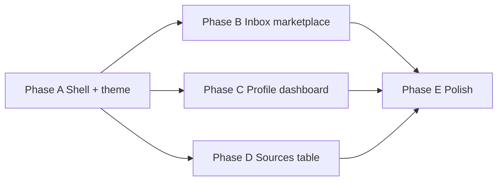

# UI redesign — marketplace + dashboard

**Goal:** Evolve `apps/web` from a functional prototype into a **modern job marketplace** surface (categories, search, filters) with a **dashboard-style Profile** — while keeping all existing APIs and local-first behavior.

**Stack lock:** Next.js 15 App Router, React 19, Tailwind CSS v4, shadcn/ui, lucide-react, TypeScript. Components are **props-only** (no fetch inside generated UI).

**Visual north star:** Refined marketplace (Linear/Stripe restraint + Indeed-style scanability), **not** a 2000s admin portal. Sidebar and main share one background tier; differentiate with borders and elevation.

**Theme:** Light + dark modes via `next-themes`, default `system`, semantic CSS variables (`--background`, `--card`, `--accent`, …).

---

## Current → target

| Area | Today | Target |
|------|-------|--------|
| Shell | Top header + `max-w-4xl` column | Collapsible sidebar + top bar (breadcrumb, stats, theme toggle, locale switcher) |
| `/inbox` | Vertical card feed | Marketplace browse: search, category chips, filters, sort, dense job cards |
| `/settings` | Single form card | Profile **dashboard**: section nav + grouped settings rows |
| `/sources` | List + toggles | Registry **table** with health badges, filters, add-URL panel |
| Theme | Light only | Light/dark + system sync |

**Non-goals for UI phase:** Multi-user auth, new match APIs, map/commute UI. Engine match text stays Chinese until locale rule packs (see [i18n.md](./i18n.md)).

---

## Data contracts (wire after import)

Reuse existing types from `@aperio-j/core` and `apps/web/src/lib/match-service.ts`:

```ts
// Inbox page props
interface InboxPageProps {
  items: InboxItem[];
  excludedItems: InboxItem[];
  summary: { city: string; desiredRoles: string[] };
  meta: {
    ranAt: string | null;
    opportunityCount: number;
    matchedCount: number;
    excludedCount: number;
    streamCount: number;
    usedFixtureFallback: boolean;
  };
  fetchErrors: string[];
  sourceDiscoveryErrors: string[];
}

// Client-side filter state (Phase 2 — no new API v1)
interface InboxFilters {
  query: string;
  categories: RoleCategory[];      // chip multi-select
  posterType: PosterType | "all";
  minScore: number;                // 0–100 slider
  showExcluded: boolean;
  sort: "score" | "recent";
}
```

API wiring unchanged — see [frontend-spec.md](./frontend-spec.md).

---

## v0 prompts

Copy each block into v0 (or Cursor) **in order**. Follow-ups reference prior output.

### Prompt 0 — Design tokens + theme (paste first)

```
Build a Next.js 15 + Tailwind + shadcn/ui theme foundation for a Chinese job marketplace called "aperio-j".

Requirements:
- Install pattern: CSS variables in globals.css for light AND .dark themes
- Accent: teal-600 light / teal-400 dark (employment/trust, not startup purple)
- Surface tiers: background → panel (sidebar) → card → inset (muted job body)
- next-themes ThemeProvider with attribute="class", defaultTheme="system", enableSystem
- Theme toggle in header: Sun/Moon icon button with aria-label
- Font: system-ui stack; zh-CN primary copy
- Custom scrollbar subtle styling for webkit
- Export: ThemeProvider wrapper, ThemeToggle component, tokens documented as comments

DO NOT: pages, sidebar, fetch, auth, mock job data yet.
NOT a generic gray admin template. NOT card-in-card-in-card nesting.
```

### Prompt 1 — App shell (sidebar dashboard)

```
Continue the aperio-j theme. Build the application shell only.

Stack: Next.js App Router layout, shadcn Sidebar, lucide icons, TypeScript.

Layout:
- Left: collapsible sidebar (icon-only on md breakpoint)
- Right: column with sticky top header + scrollable main
- Sidebar and main share the same --background; sidebar separated by border-r only

Sidebar groups (Chinese labels):
1. 发现 — 匹配机会 (/inbox), 信号源 (/sources)
2. 我的 — Profile 设置 (/settings)

Header (sticky):
- Breadcrumb: section + page title
- Stat pills (placeholder): "8 信号源" "15 匹配"
- Actions: 刷新匹配 (primary ghost), ThemeToggle
- User context chip: city + intent summary e.g. "深圳 · 质检、仓储"

Main: full width max-w-7xl mx-auto px-4 py-6 (NOT narrow centered column)

Export AppShell component with props:
  children, breadcrumb, stats?, primaryAction?, profileSummary?
Use next/link for nav. Active route highlight in sidebar.

DO NOT: inbox cards, profile forms, API calls, extra routes (Billing, Team).
```

### Prompt 2 — Marketplace inbox (`/inbox`)

```
Using the aperio-j AppShell, build the "匹配机会" marketplace browse page. Props-only.

Page archetype: searchable queue / marketplace grid.

Top toolbar (below breadcrumb):
- Full-width search input with Search icon, placeholder "搜索职位、公司、技能关键词…"
- Row of category chips (toggle multi): 质检, 仓储, 物料, 文职, 设备维护, 普工/产线, 销售, 其他
- Filter button opening Sheet/Popover: 发布方 (直招/中介/全部), 最低匹配分 slider 0–100, 排序 (匹配度/最近)
- Secondary: "粘贴职位链接" collapsible panel (url input + 添加并匹配 button)

Results header:
- "15 个机会" + last updated timestamp
- Toggle: 显示已过滤 (N)

Job cards (marketplace style, NOT blog posts):
- Left: title (font-semibold), meta row (location, employer hint, poster badge)
- Right: large score ring or badge "82", confidence pill
- Body: 2-line clamp excerpt
- Footer row: source label + kind badge + 查看原文 link
- Action row: 不感兴趣 | 疑似中介 | 已申请 (ghost buttons)
- Warning line for trust cautions (amber, compact)

Empty state: shadcn Empty — icon Briefcase, title, description, CTA 去设置 Profile
Loading: skeleton cards x3

Export types:
  InboxItem, InboxFilters, InboxMarketplaceViewProps
Include realistic mock data (3 items, Chinese copy, Shenzhen jobs).

DO NOT: fetch, useRouter for API, excluded section implementation (prop only).
```

### Prompt 3 — Profile dashboard (`/settings`)

```
Using aperio-j AppShell, build Profile settings as a dashboard (NOT one big form card).

Two-column layout on lg+:
- Left (w-56): vertical section nav with icons
  Sections: 定位, 工作形态, 背景与技能, 意向方向, 排除规则, 信任偏好
- Right: scrollable grouped settings panels

Each section: Card with title + description, form fields inside.
Use shadcn: Input, Textarea, Label, Switch, ToggleGroup for employment types.

Fields (Chinese labels, map to ProfileSettingsForm):
- 定位: 工作城市 (required), 也可接受的城市
- 工作形态: 全职/兼职/合同 toggles
- 背景与技能: large textarea
- 意向方向: comma input for desired roles
- 排除规则: avoid list textarea, switches 排除产线/排除销售
- 信任偏好: read-only summary row "隐藏风险帖 · 优先直招 · 过滤中介" (badges)

Sticky footer bar on right column: 保存并运行匹配 (primary), cancel ghost

Export ProfileDashboardProps with initialForm, onSubmit callback prop (no fetch).

DO NOT: GitHub import, wizard steps, avatar upload.
```

### Prompt 4 — Sources registry (`/sources`)

```
Using aperio-j AppShell, build 信号源 registry page. Props-only.

Top: summary cards row — 已启用, 健康, 上次发现时间
Toolbar: 重新发现 button (primary outline), 添加自定义 URL (opens Dialog)

Main: shadcn DataTable-style list (can be div-based, not tanstack required):
Columns: 名称, 类型 (RSS/列表页/手动), 地区, 健康 (Badge dot), 置信度, 启用 Switch, 操作 ⋯

Row badges: 自定义 vs 自动发现
Health: 正常/陈旧/失效/未知 with semantic colors

Empty: no streams — CTA 保存 Profile 后自动发现

Export SourcesRegistryProps with streams[], onToggle, onDiscover, onAddUrl mocks.

DO NOT: fetch, delete confirm wiring.
```

### Prompt 5 — Polish pass (apply to all pages)

```
Polish pass on aperio-j UI components:

1. Dark mode: verify contrast on badges, muted text, borders (no invisible borders)
2. Responsive: sidebar → sheet on mobile; filter chips horizontal scroll
3. Focus rings on all interactive elements; aria-labels on icon buttons
4. Reduce nested Card borders — one card per job, inset for body only
5. Motion: subtle hover on job cards (shadow-sm → shadow-md), respect prefers-reduced-motion
6. Split files: components/shell/, components/inbox/, components/profile/, components/sources/
7. Status strings → Badge components everywhere

Keep props-only. No new routes.
```

---

## Implementation phases

Execute **after** prompts are approved or v0 output is imported. Each phase ends with `pnpm dev` smoke + `pnpm --filter @aperio-j/web typecheck`.

### Phase A — Foundation (shell + theme) ✅

| Task | Output |
|------|--------|
| A.1 | `next-themes`, dark CSS variables, `ThemeProvider` in `layout.tsx` |
| A.2 | Primitives updated for semantic tokens (shadcn CLI deferred) |
| A.3 | `AppShell` replaces header-only layout; `(main)` route group |
| A.4 | `design-system/MASTER.md` — accent, surfaces, typography |

**Done when:** Sidebar nav works; theme follows system; all routes render in shell.

### Phase B — Marketplace inbox ✅

| Task | Output |
|------|--------|
| B.1 | `InboxMarketplaceView` + shadcn components; wired to existing inbox data |
| B.2 | `useInboxFilters` — search, chips, poster filter, min score, sort |
| B.3 | `roleCategories` → chip labels via `inbox.categories.*` i18n |
| B.4 | Preserve: capture URL (collapsible), feedback, excluded toggle, refresh |

**Done when:** Filters work on loaded items without API change.

### Phase C — Profile dashboard ✅

| Task | Output |
|------|--------|
| C.1 | Section nav + panels on `/settings` |
| C.2 | Fields split into grouped shadcn Cards (`components/profile/`) |
| C.3 | Trust preferences as read-only badges (`DEFAULT_TRUST`) |
| C.4 | Sticky save bar; first-setup uses same layout (no cancel) |

**Done when:** All Profile fields save via existing `POST /api/profile`.

### Phase D — Sources registry ✅

| Task | Output |
|------|--------|
| D.1 | shadcn Table + summary stat cards (enabled, healthy, last discovery) |
| D.2 | Dialog add URL, discover/toggle/delete APIs wired |
| D.3 | `StreamHealthBadge` with semantic dot colors |

**Done when:** Feature parity with prior `/sources` + new layout.

### Phase E — Polish + docs ✅

| Task | Output |
|------|--------|
| E.1 | Mobile nav Sheet, `PageEmpty`, Skeleton loading states |
| E.2 | `frontend-spec.md` v2 |
| E.3 | Skip link, aria labels, semantic tokens, a11y checklist in spec |

**Done when:** Phases A–E complete per [ui-redesign.md](./ui-redesign.md).

---

## Suggested build order



**Recommended first PR:** Phase A only (visual foundation, minimal behavior change).  
**Second PR:** Phase B (highest user-visible impact — matches your screenshot pain point).

---

## Reject list (v0 and implementation)

- Extra nav items: 分析, 团队, 账单, 消息
- `fetch()` inside presentational components
- Replacing algorithmic match with keyword-only search (search filters **loaded** results only in v1)
- Card-in-card-in-card layout
- Light-only theme
- English-first copy (zh-CN primary)

---

**Last updated:** 2026-07-04
